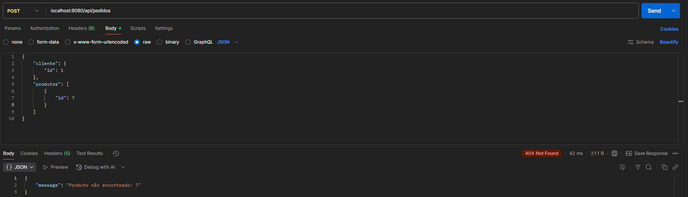

## Sobre
Este projeto é uma aplicação Backend desenvolvida na linguagem Java com Spring Boot, 
projetada com o objetivo de demonstrar boas práticas de desenvolvimento de software.

O projeto consiste em um sistema de pedidos e entregas, que permite explorar funcionalidades 
como validações, exceções, persistência e testes unitários.

## Tecnologias Utilizadas
- Java
- Spring Boot
- Spring Data JPA
- RabbitMQ
- Lombok
- H2 Database

## Funcionalidades

- O fluxo de gerar um novo pedido irá receber dados como código do cliente e código dos produtos, e ao final do fluxo, irá registrar no banco *PEDIDO* o código do cliente, valor do pedido e endereço de entrega.

- Ao criar o pedido, será enviada uma mensagem para a fila, e após ela ser processada, será registrado no banco *ENTREGA* o pedido realizado.

- Existe uma tabela intermediária, *PRODUTO_PEDIDO*, que registrará o código do pedido e o código dos produtos.

## Relacionamento entre tabelas

## Passo a passo

- Rodar o Docker:
  - Suba o container através do comando: docker compose up --build
- Acesse o RabbitMQ: http://localhost:15672/
  - Dados de acesso:

    - **Username**: admin
    - **Password**: 123456
    
-Teste a aplicação com o Postman:

    - curl --location 'localhost:8080/api/pedidos' \

    --header 'Content-Type: application/json' \

    --data '{
        "cliente": {
            "id": 2
        },
        "produtos": [
            {
                "id": 1
            },
            {
                "id": 2
            }
        ]
    }'
**Exemplos de testes:**
 
Teste de sucesso

Teste de cliente com id inválido

Teste de produto com id inválido

Teste de cliente com id null

Teste com lista vazia de produtos

- Após enviar a requisição via postman, no RabbitMQ, aparecerá uma mensagem sendo processada pela fila correspondente.